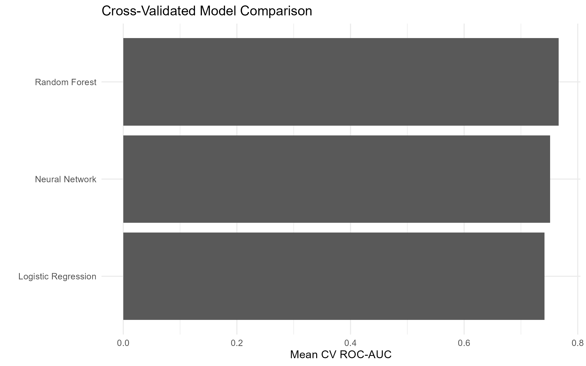
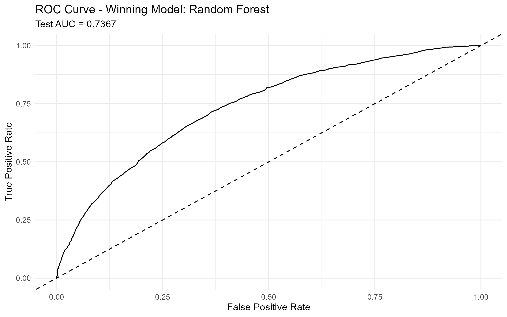
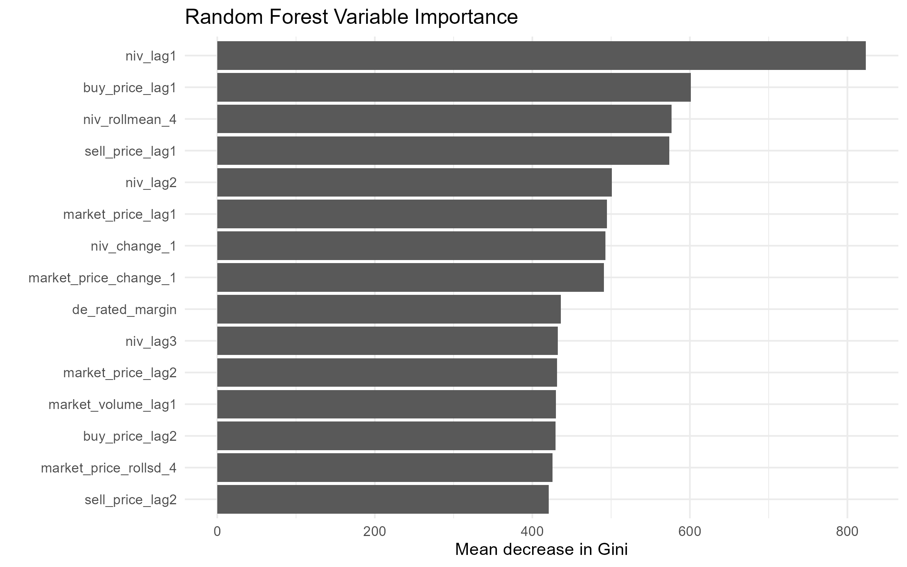
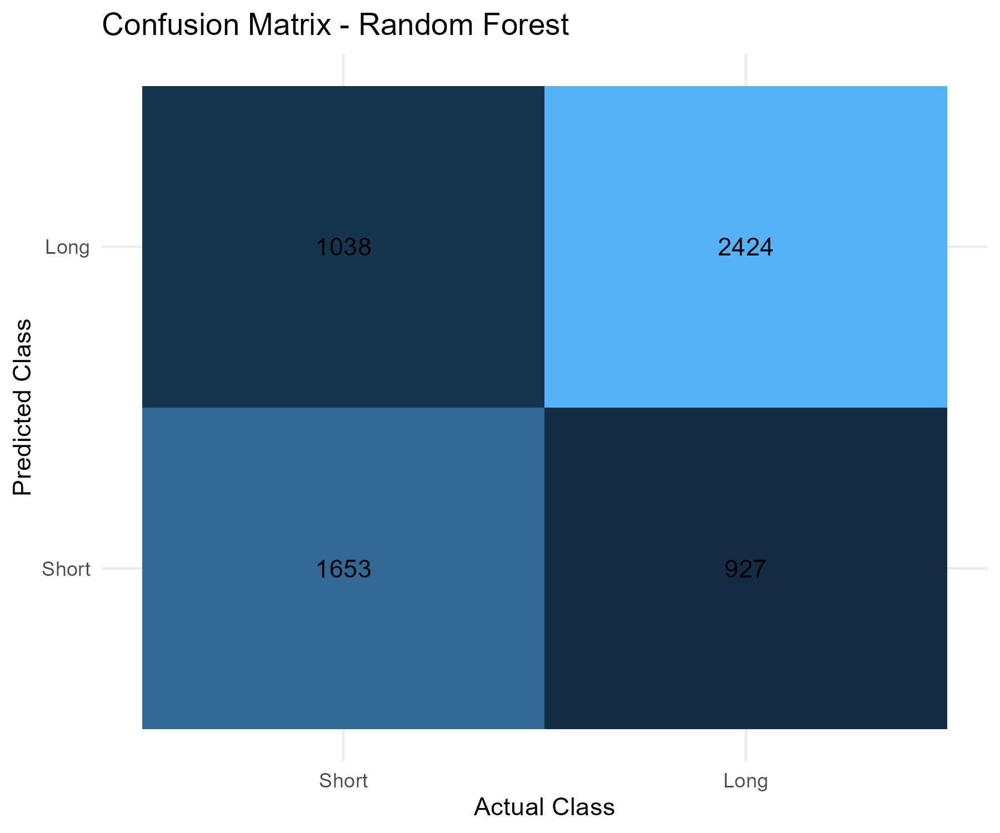
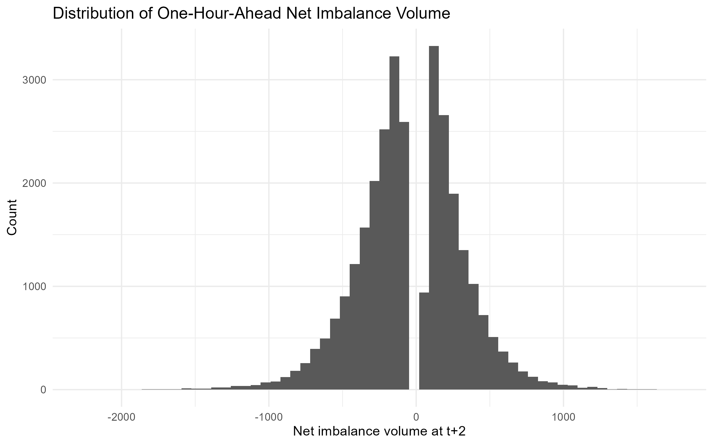

# Forecasting Great Britain Electricity Market Imbalance Conditions

This project applies econometric and machine learning methods to forecast one-hour-ahead electricity system imbalance conditions in Great Britain. The goal is to evaluate whether electricity-market fundamentals and settlement data can be used to generate directional trading signals.

## Project Overview

Electricity markets require continuous balancing between supply and demand. When the system is expected to be short or long, market participants may face different pricing, operational, and trading implications.

This project uses historical Elexon settlement and market index data to classify future imbalance conditions and compare model performance across several predictive approaches.

## Data

The project uses Great Britain electricity-market data covering more than 40,000 half-hour settlement periods from January 2024 through April 2026.

Key variables include:

* Net imbalance volume
* System buy and sell prices
* Market index prices and volumes
* De-rated margin
* Calendar and settlement-period features

Raw data is not included in this repository due to file size. The analysis script assumes that monthly SSD and MD1 files are placed locally in `data/raw/`.

## Methods

Models evaluated include:

* Logistic regression
* Random forest
* Neural network

The project uses:

* Feature engineering
* Lagged imbalance and price variables
* Rolling-window features
* Cyclical time features
* Chronological train-test split
* Cross-validation
* ROC-AUC evaluation

## Results

The strongest models achieved cross-validated ROC-AUC scores above 0.84. Predictive performance improved through target refinement, lag construction, rolling features, and market-specific feature engineering.

## Key Takeaway

The results suggest that electricity-market fundamentals contain useful short-term predictive information for forecasting imbalance conditions. The project also shows that careful target construction and feature engineering can matter more than model complexity alone.

## Repository Structure

```text
src/
  electricity_imbalance_modeling.R

docs/
  gb_electricity_imbalance_forecasting_paper.pdf

notebooks/outputs/figures/
  Model performance figures and visualizations
```

## Selected Figures

### Model Comparison



### Winning Model ROC Curve



### Variable Importance



### Confusion Matrix



### Distribution of One-Hour-Ahead Net Imbalance Volume




## Tools Used

* R
* caret
* randomForest
* nnet
* pROC
* tidyverse
* Econometrics
* Machine learning
* Forecasting
* Data visualization

## Author

Thomas Swide
MA Candidate, Political Economy with Data Analytics
Tulane University
